# InventoryManagementApp

> ポートフォリオ用の在庫管理アプリケーション  
> Django を使った簡易在庫管理システムで、商品管理・在庫数量管理・在庫一覧のCSVダウンロードなどの機能を提供します。

---

## 目次
- [InventoryManagementApp](#inventorymanagementapp)
  - [目次](#目次)
  - [概要](#概要)
  - [アプリURL](#アプリurl)
  - [機能](#機能)
  - [技術スタック](#技術スタック)
  - [基本的な使い方](#基本的な使い方)
    - [1. ログイン画面の新規登録リンクをクリック](#1-ログイン画面の新規登録リンクをクリック)
    - [2. ユーザー名とパスワードを入力して登録する](#2-ユーザー名とパスワードを入力して登録する)
    - [3. 在庫管理画面の新規登録ボタンをクリックする](#3-在庫管理画面の新規登録ボタンをクリックする)
    - [4. 商品情報を入力し追加するボタンをクリックする](#4-商品情報を入力し追加するボタンをクリックする)
    - [5. 商品が追加され在庫管理画面に遷移する](#5-商品が追加され在庫管理画面に遷移する)
  - [その他の機能](#その他の機能)
    - [在庫一覧のCSVダウンロード](#在庫一覧のcsvダウンロード)
    - [商品の編集](#商品の編集)
    - [商品の削除](#商品の削除)

---

## 概要
このアプリは、個人のポートフォリオとして開発した在庫管理システムです。  
- 商品の登録・編集・削除  
- 在庫数の管理  
- 在庫一覧のCSVダウンロード
- ユーザー認証によるアクセス制御  

開発を通して Django による CRUD 操作、モデル設計などのスキルを示しています。

---

## アプリURL
https://inventory-management-app-production-90bb.up.railway.app/

---

## 機能
- 商品管理（作成・編集・削除）
- 在庫数量の更新
- ユーザー登録 / ログイン / ログアウト
- レスポンシブデザイン（Bootstrap 使用）

---

## 技術スタック
- **言語**: Python 3.13.6
- **フレームワーク**: Django 5.0.2
- **フロントエンド**: Bootstrap 5, HTML5, Javascript
- **データベース**: SQLite
- **Docker**: Dockerfile + docker-compose で開発環境構築

---

## 基本的な使い方

### 1. ログイン画面の新規登録リンクをクリック
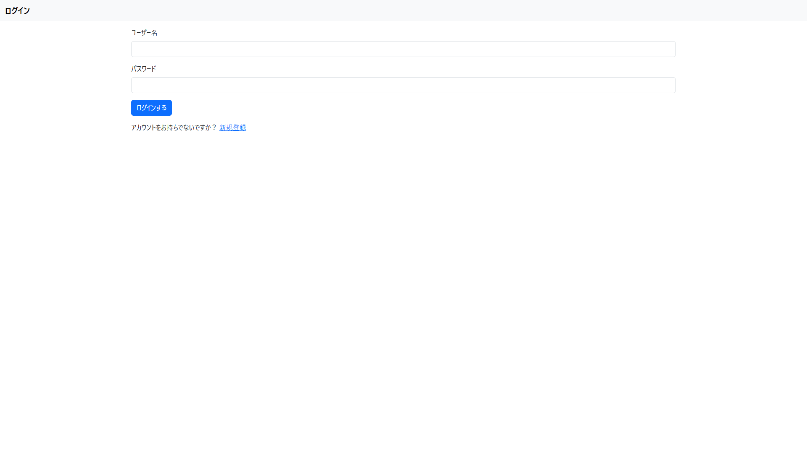
### 2. ユーザー名とパスワードを入力して登録する
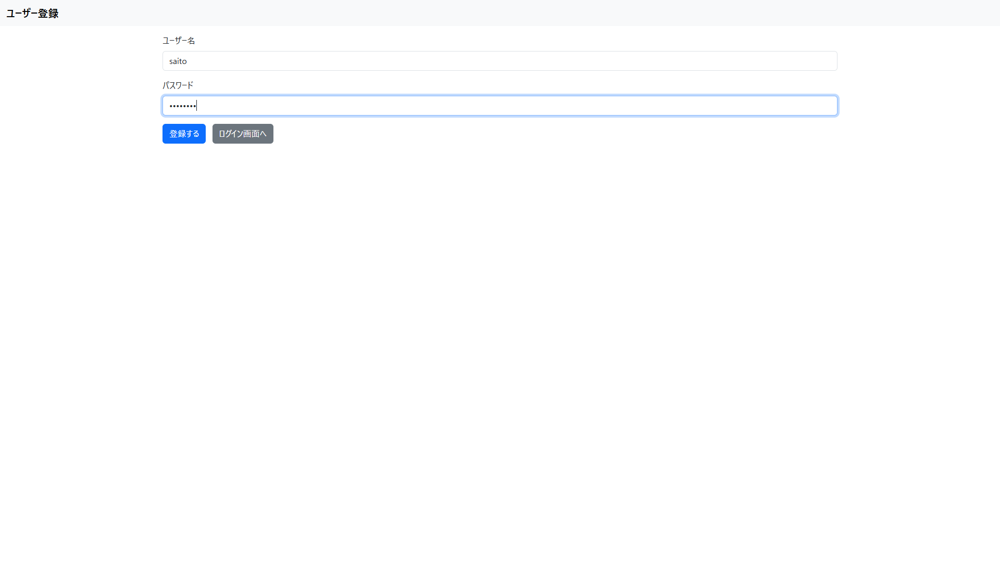
### 3. 在庫管理画面の新規登録ボタンをクリックする
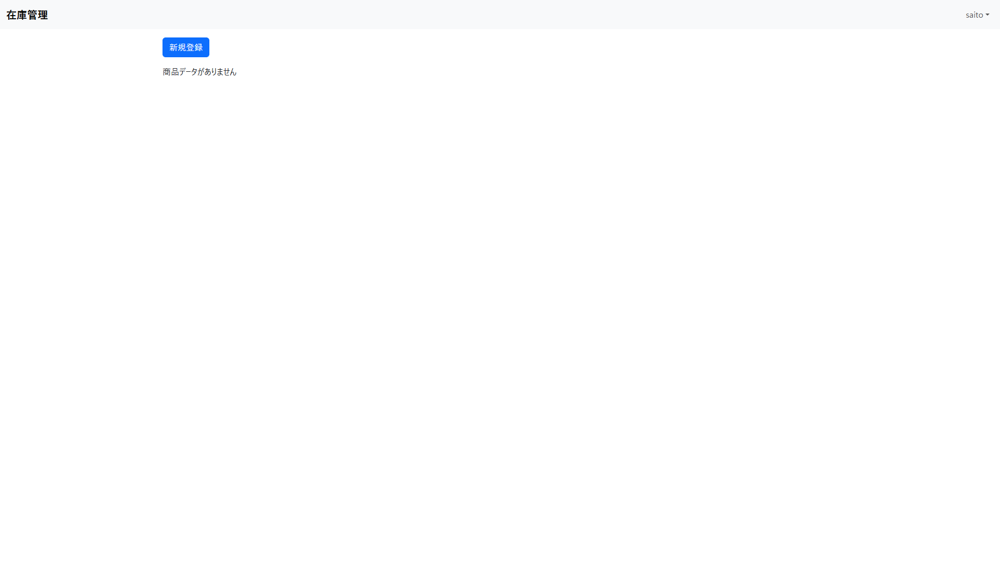
### 4. 商品情報を入力し追加するボタンをクリックする
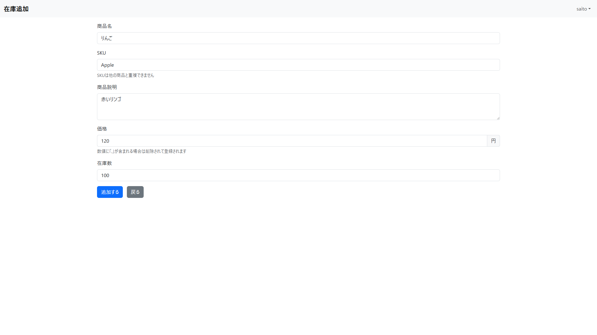
### 5. 商品が追加され在庫管理画面に遷移する
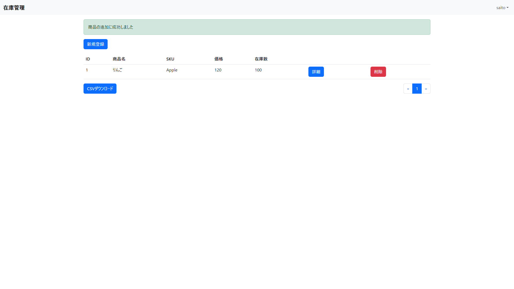

---

## その他の機能

### 在庫一覧のCSVダウンロード
1. 在庫管理画面でCSVダウンロードのボタンをクリック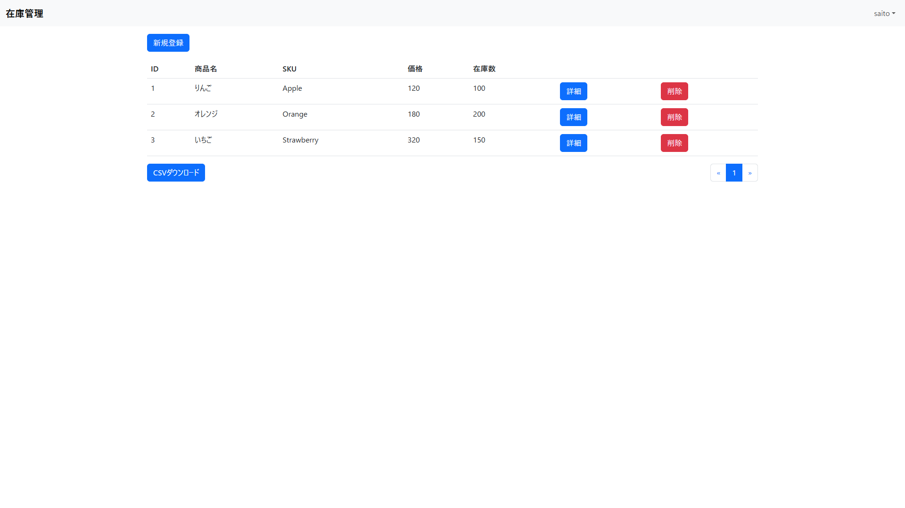
2. 在庫一覧がCSVダウンロードできる([sample.csv](docs/sample.csv))

### 商品の編集
1. 在庫管理画面で詳細ボタンをクリック
2. 詳細画面で編集モードのスイッチをクリックして編集モードをONにする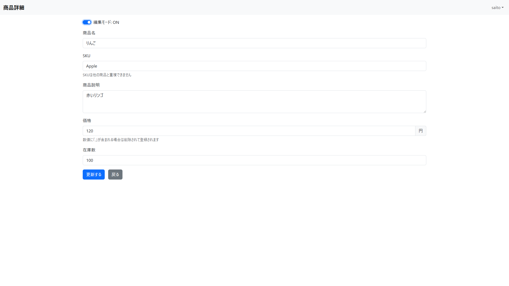
3. 各項目を編集し更新するボタンをクリックする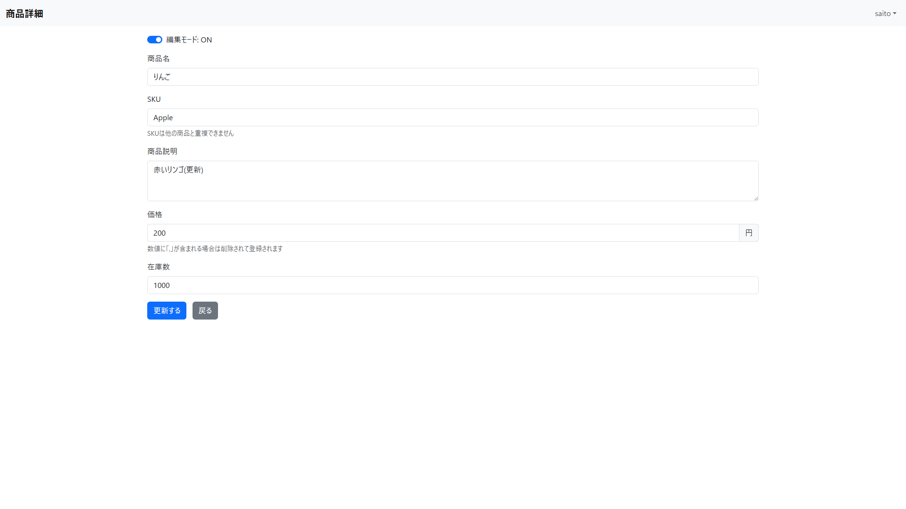
4. 商品が更新され更新成功のメッセージが表示される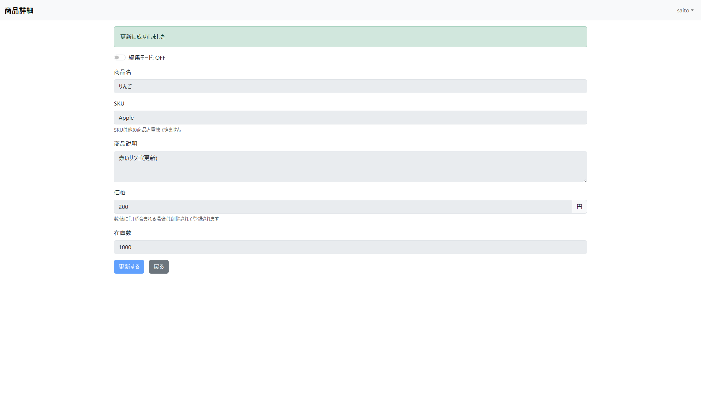

### 商品の削除
1. 在庫管理画面で削除のボタンをクリックする
2. 確認ダイアログが表示されるのでOKをクリックする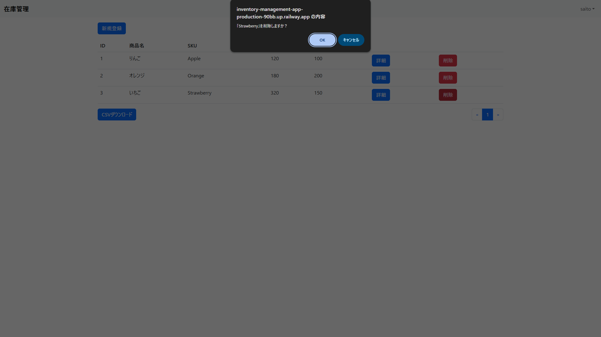
3. 商品が削除され削除成功のメッセージが表示される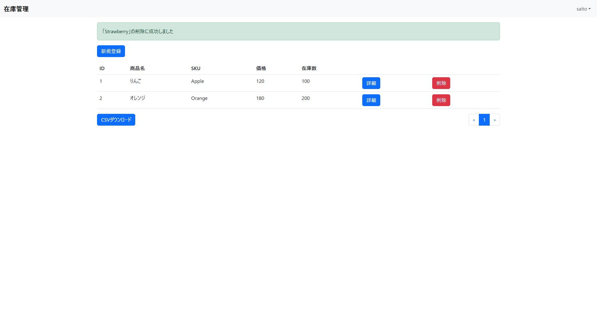